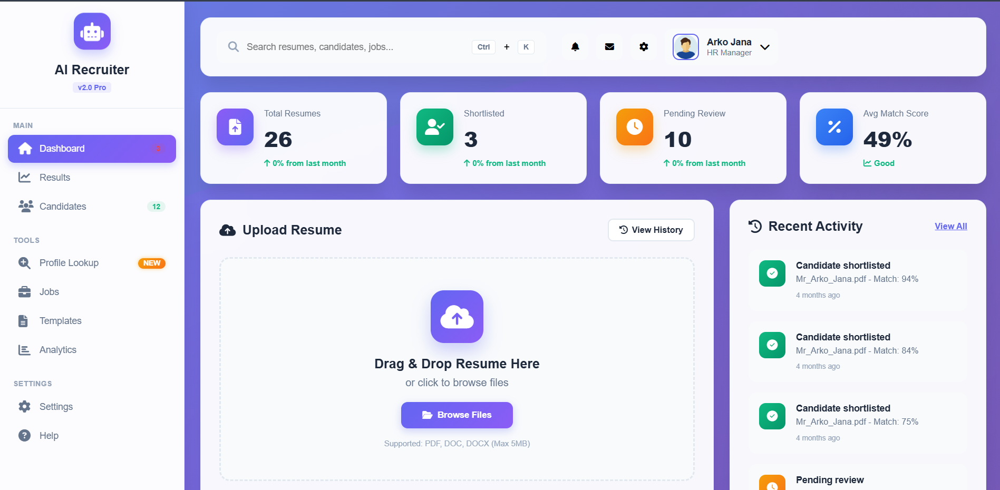

# AI Resume Screening System

An AI-powered resume screening system that automatically analyzes and ranks candidates using advanced Natural Language Processing (NLP) and Large Language Models (LLM).



## Features

- **Automated Resume Parsing:** Extracts text from PDF resumes.
- **AI Analysis:** Analyzes resume content using Google's Generative AI (Gemini) to evaluate candidate skills, experience, and suitability.
- **Candidate Ranking:** Ranks candidates based on job descriptions and requirements.
- **User Authentication:** Secure login and registration using JWT and bcrypt.
- **Email Notifications:** Automated email communication using Nodemailer.

## Tech Stack

### Backend
- **Node.js & Express.js**
- **MongoDB & Mongoose** (Database)
- **@google/generative-ai** (AI Integration)
- **pdf-parse** (PDF Extraction)
- **jsonwebtoken & bcrypt** (Authentication)
- **natural** (NLP tasks)
- **nodemailer** (Email service)

### Frontend
- The repository contains two frontend implementations:
  - `frontend/`: Vanilla HTML, CSS, and JavaScript.
  - `frontend-react/`: React.js based frontend.

## Project Structure

```text
├── backend/            # Express server, routes, controllers, and models
├── frontend/           # Vanilla JS frontend
├── frontend-react/     # React frontend
├── package.json        # Project metadata and dependencies
└── .env                # Environment variables configuration
```

## Getting Started

### Prerequisites

- Node.js (v14 or higher)
- npm or yarn
- MongoDB (Local or Atlas)
- Google Gemini API Key

### Installation

1. **Clone the repository:**
   ```bash
   git clone https://github.com/MR-ARKO-JANA/-AI-Resume-Screening-System.git
   cd "AI RESUME SCREENING SYSTEM - DONE/Coding Section"
   ```

2. **Install dependencies:**
   ```bash
   npm install
   ```

3. **Environment Setup:**
   Create a `.env` file in the root directory and add the necessary environment variables (refer to `.env.example` if available, or configure the database, JWT secret, and API keys). Typical variables might include:
   ```env
   PORT=5000
   MONGO_URI=your_mongodb_connection_string
   JWT_SECRET=your_jwt_secret_key
   GEMINI_API_KEY=your_google_gemini_api_key
   ```

4. **Start the backend server:**
   ```bash
   # For development with nodemon
   npm run dev
   
   # For production
   npm start
   ```

5. **Start the frontend:**
   - **For Vanilla JS:** Open `frontend/html/index.html` in your browser.
   - **For React:** Navigate to `frontend-react/`, run `npm install`, and then `npm start`.

## License
MIT License
